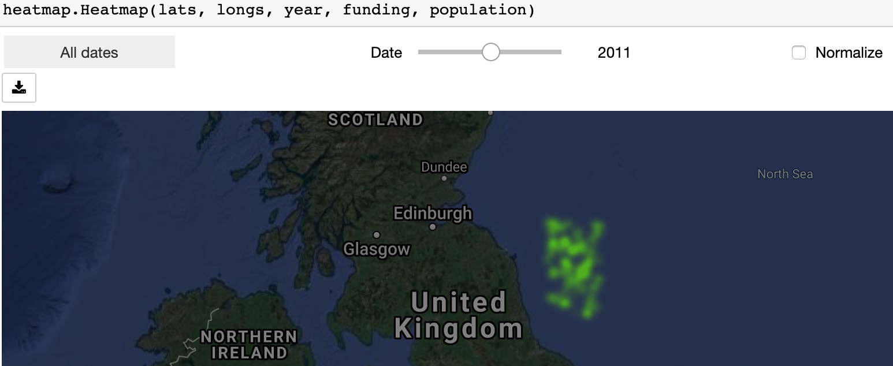

# jupyter-map
This is a simple widget that allows visualizing a heatmap in a jupyter notebook. It requires numpy and gmaps. It is necessary to set up a Google API key and configure it as such:
```python
import gmaps
gmaps.configure(api_key=GOOGLE_API_KEY)
```

Then:
